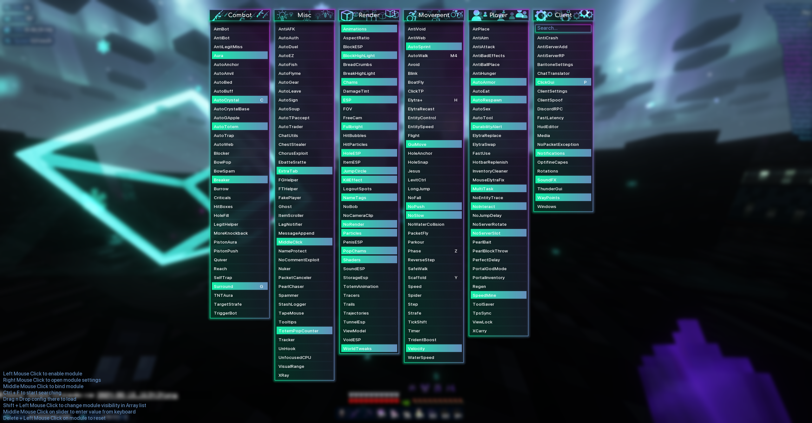
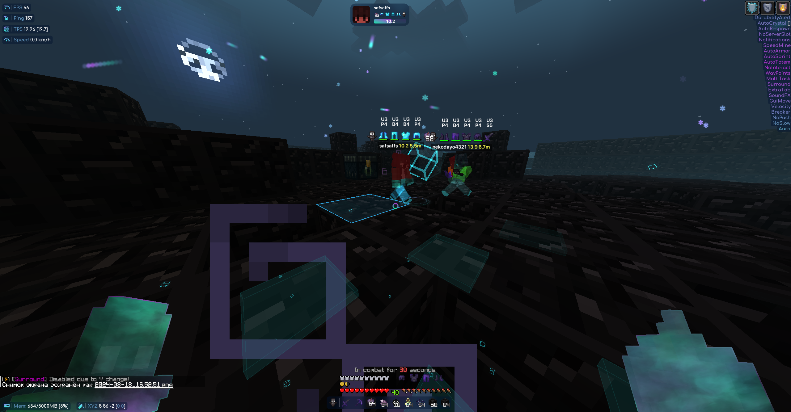
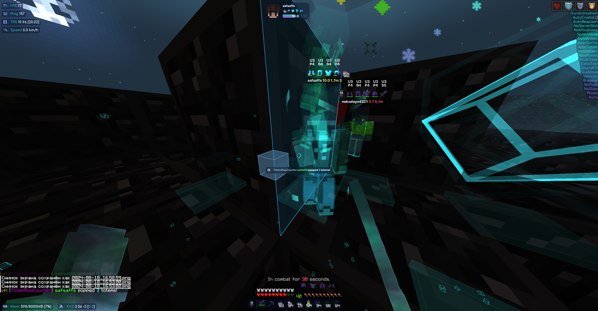
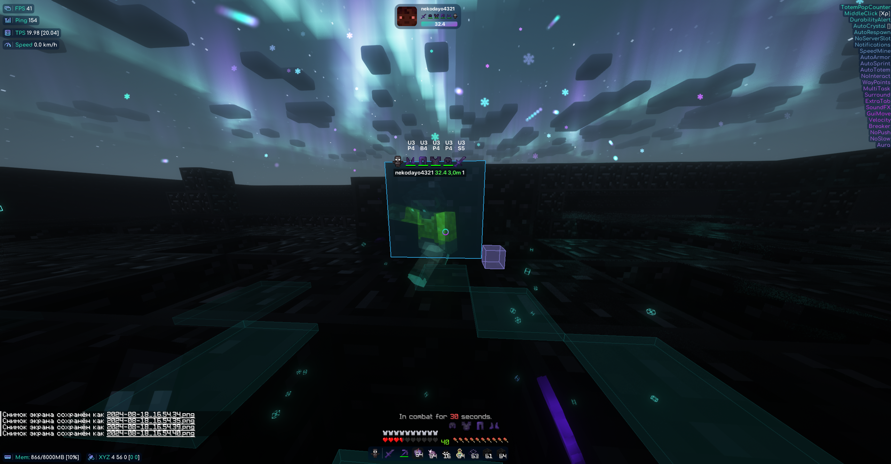

<p align="center">
    
</p>

<div align="center">

[](https://github.com/Golopmoui3/ThunderHack-Reborn/actions/workflows/gradle.yml)


</div>

# ⚡ ThunderHack Reborn

Community continuation of the legendary **ThunderHack Recode** by Pan4ur (archived, was stuck on 1.21),
retargeted to **Minecraft Fabric 1.21.11** — the last version with Yarn mappings.

Client for Crystal / Sword PvP: KillAura, AutoCrystal, Surround, HoleSnap, ESP, speed, flight,
ClickGUI (`P`), HUD editor, configs, macros, waypoints, proxy support and more.

> Based on [Pan4ur/ThunderHack-Recode](https://github.com/Pan4ur/ThunderHack-Recode) v1.7 (GPL-3.0).
> Original development is stopped; this fork keeps the code alive on modern versions.

## Information

- Minecraft version: ```Fabric``` 1.21.11
- Default ClickGui keybind - **```P```**
- Default prefix - **```@```**
- Middle click the module to bind it.

## Requirements

- [Java 21+](https://adoptium.net/temurin/releases/?version=21)
- [Fabric Loader 0.19.5+](https://fabricmc.net/use/installer/) for Minecraft 1.21.11
- [Fabric API 0.141.6+1.21.11](https://modrinth.com/mod/fabric-api/versions?g=1.21.11)
- Optional: [Baritone](https://github.com/MeteorDevelopment/meteor-client) `1.21.11` build (Meteor fork) for `Goto`, auto-pause in Aura etc.
- Recommended for FPS: Sodium + Lithium + FerriteCore (1.21.11 builds)

## Install / Установка

1. Install **Java 21**, **Fabric Loader 1.21.11** (vanilla launcher or any custom launcher).
2. Put **Fabric API** (1.21.11 build) into the `mods` folder.
3. Download `thunderhack-reborn-*.jar` from
   [Releases](https://github.com/Golopmoui3/ThunderHack-Reborn/releases) (tag `latest`, built by CI)
   and put it into `mods`.
4. (Optional) add Baritone for Minecraft 1.21.11 into `mods`.
5. Launch the game with the Fabric 1.21.11 profile. Press `P` for ClickGUI, type `@help` in chat.

## Build from source

```bash
git clone https://github.com/Golopmoui3/ThunderHack-Reborn.git
cd ThunderHack-Reborn
./gradlew build
# jar: build/libs/thunderhack-reborn-*.jar (without -sources)
```

Toolchain: Gradle 9.5.1, Loom-remap 1.17, Yarn `1.21.11+build.6`, Java 21.

To update Yarn renames semi-automatically (code is Yarn-based):

```bash
./gradlew migrateMappings --mappings "1.21.11+build.6"
```

## Roadmap

- [x] Rebrand + buildscript for 1.21.11 (Loader 0.19.5, Fabric API 0.141.6, Baritone 1.21.11-SNAPSHOT)
- [ ] `migrateMappings` Yarn 1.21 → 1.21.11 rename pass
- [ ] Fix 1.21 → 1.21.11 vanilla API breakages (compile + runtime check in dev client)
- [ ] CI release jar verification in-game
- [ ] (later) migration to Mojang mappings → Minecraft 26.x

## Credits

- [Pan4ur](https://github.com/Pan4ur) and **06ED** — original ThunderHack Recode
- [@meteordevelopment](https://github.com/meteordevelopment) for orbit
- [@ladysnake](https://github.com/ladysnake) for satin
- [@0x3C50](https://github.com/0x3C50/Renderer) for the renderer
- [Ai_24](https://www.youtube.com/@Ai_24) for cool showcase
- [KiLAB Gaming](https://www.youtube.com/@KiLABGaming) for complete overview

## Screenshots
<details>
<summary>GUI</summary>


</details>
<details>
<summary>CRYSTAL HVH</summary>




</details>
<details>
<summary>SWORD HVH</summary>


</details>

## Addons

### Resources

- [Addon Template](https://github.com/cvs0/ThunderHack-Recode-Addon-Template) by cvs0 (needs update for Reborn API)

## License

GPL-3.0, see [LICENSE](LICENSE).
